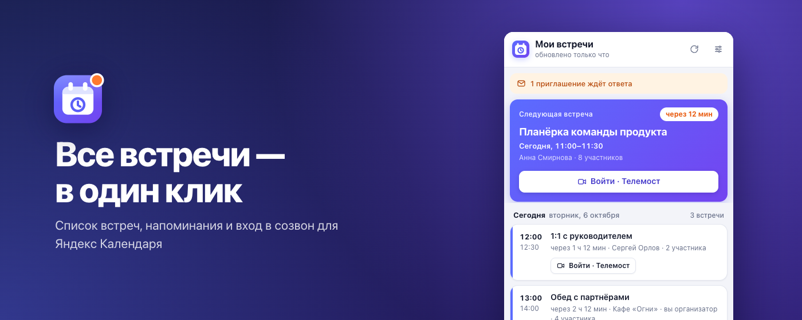
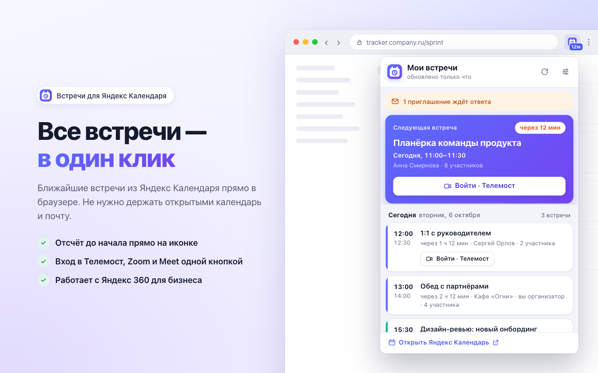
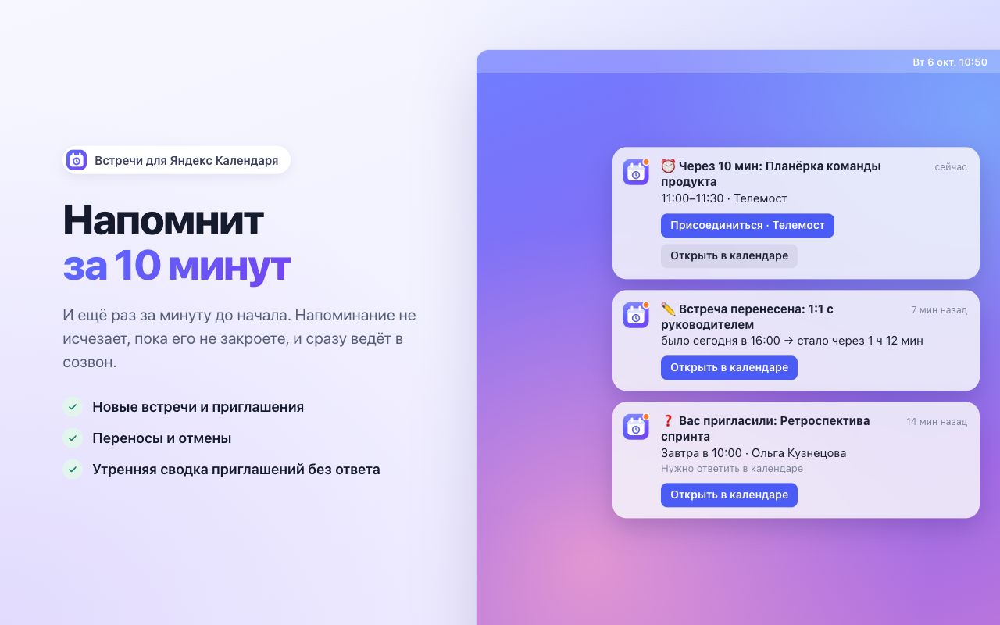
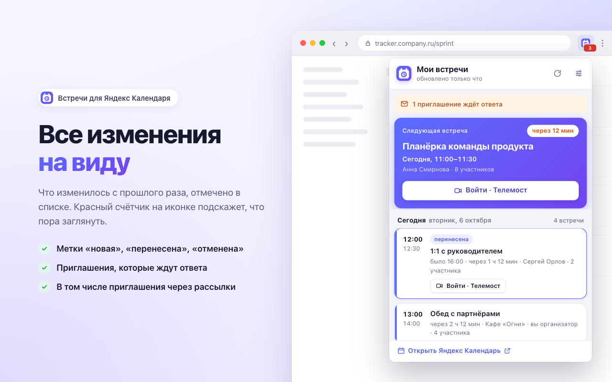
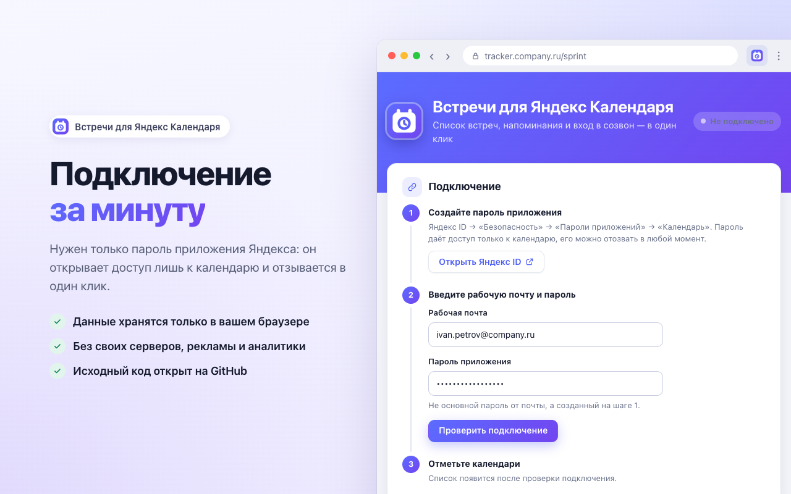

<div align="center">


# Встречи для Яндекс Календаря

**Расширение для Chrome: ближайшие встречи в один клик, отсчёт до начала на иконке,<br>напоминания и вход в созвон одной кнопкой.**

[](https://github.com/CoolyWooly/ext_yandex_calendar/actions/workflows/ci.yml)
[](CHANGELOG.md)
[](LICENSE)
[](https://developer.chrome.com/docs/extensions/develop/migrate/what-is-mv3)

[Установить](#установка) · [Возможности](#возможности) · [Приватность](#приватность) · [Вопросы](#вопросы-и-ответы) · [Сообщить об ошибке](https://github.com/CoolyWooly/ext_yandex_calendar/issues/new/choose)



</div>

Календарь и почта закрыты — а встреча через пять минут. Расширение держит ваши встречи из Яндекс Календаря под рукой: показывает, что дальше, считает минуты до начала прямо на иконке и напоминает так, что не пропустишь. Подходит для **Яндекс 360 для бизнеса**.

## Возможности

<table>
  <tr>
    <td width="50%" valign="top">
      
      <h3>Все встречи в один клик</h3>
      Текущая или ближайшая встреча — крупно, с отсчётом до начала. Ниже — сегодня, завтра и неделя вперёд. Клик по встрече открывает её в Яндекс Календаре.
    </td>
    <td width="50%" valign="top">
      
      <h3>Напоминания, которые не пропустишь</h3>
      За 10 и за 1 минуту до начала (время настраивается). Напоминание висит, пока его не закроете, и сразу ведёт в созвон.
    </td>
  </tr>
  <tr>
    <td width="50%" valign="top">
      
      <h3>Все изменения на виду</h3>
      Уведомления о новых встречах, переносах и отменах, метки «новая», «перенесена», «отменена» в списке и красный счётчик на иконке.
    </td>
    <td width="50%" valign="top">
      
      <h3>Подключение за минуту</h3>
      Нужен только пароль приложения Яндекса: он открывает доступ лишь к календарю и отзывается в один клик.
    </td>
  </tr>
</table>

А ещё:

- 🎥 **Вход в созвон одной кнопкой** — Телемост, Google Meet, Zoom, Teams, SberJazz и Контур.Толк.
- ⏱️ **Отсчёт на иконке** — за час до встречи минуты до начала, за 10 минут — оранжевым, «идёт» в первые минуты встречи.
- 📨 **Приглашения без ответа**, в том числе пришедшие через рассылку: метка в списке и сводка раз в день.
- 🌗 **Светлая и тёмная тема** — как в системе.
- 🔒 **Никаких своих серверов**: расширение говорит только с Яндекс Календарём.

## Установка

> **Chrome Web Store** — расширение готовится к публикации, ссылка появится здесь. Пока его можно поставить из архива.

<details open>
<summary><b>Из архива</b></summary>

1. Скачайте `yandex-calendar-meetings-<версия>-chrome.zip` из [последнего релиза](https://github.com/CoolyWooly/ext_yandex_calendar/releases/latest) и распакуйте.
2. Откройте в Chrome `chrome://extensions` и включите «Режим разработчика» справа вверху.
3. Нажмите «Загрузить распакованное» и выберите распакованную папку.

</details>

<details>
<summary><b>Из исходников</b></summary>

Нужен Node.js 22 или новее.

```bash
git clone https://github.com/CoolyWooly/ext_yandex_calendar.git
cd ext_yandex_calendar
npm install
npm run build
```

Затем «Загрузить распакованное» в `chrome://extensions` и папка `.output/chrome-mv3`. Обновление: `git pull`, `npm run build` и кнопка обновления на карточке расширения.

</details>

### Подключение календаря

1. Создайте пароль приложения: [Яндекс ID → Безопасность → Пароли приложений](https://id.yandex.ru/security/app-passwords) → «Календарь».
2. На странице настроек расширения (откроется сама после установки) введите рабочую почту целиком — `name@company.ru` — и пароль приложения, нажмите «Проверить подключение».
3. Отметьте календари, встречи из которых нужно показывать. Календари переговорок лучше не отмечать — иначе придут уведомления о каждой брони.
4. Нажмите «Показать тестовое уведомление» — оно должно появиться и не исчезать.

## Приватность

- Расширение обращается **только** к `caldav.yandex.ru` — серверу Яндекс Календаря. Других сайтов оно не открывает, вкладки и историю не читает.
- Встречи и пароль приложения хранятся **только в вашем браузере**. Своих серверов, рекламы и аналитики нет.
- Нужен именно пароль приложения, а не основной: он даёт доступ лишь к календарю и отзывается в Яндекс ID в один клик.

Подробно — в [политике конфиденциальности](PRIVACY.md) и [заметках о безопасности](SECURITY.md).

## Вопросы и ответы

<details>
<summary><b>Уведомлений нет или они сразу исчезают (macOS)</b></summary>

«Системные настройки → Уведомления → Google Chrome»: разрешите уведомления и выберите стиль «Постоянно». В режиме «Не беспокоить» macOS их не показывает.
</details>

<details>
<summary><b>Почему нужен пароль приложения, а не вход через Яндекс?</b></summary>

Календарь Яндекса доступен сторонним программам по протоколу CalDAV только с паролем приложения. Это безопаснее основного пароля: он открывает только календарь, и его можно отозвать в любой момент, не меняя пароль от аккаунта.
</details>

<details>
<summary><b>Можно ли ответить на приглашение из расширения?</b></summary>

Пока нет — расширение откроет встречу в Яндекс Календаре, ответить можно там.
</details>

<details>
<summary><b>Почему «Открыть» у повторяющейся встречи ведёт не на ту дату?</b></summary>

Яндекс отдаёт одну ссылку на всю серию, поэтому она может вести на первую встречу серии.
</details>

<details>
<summary><b>Как часто проверяется календарь?</b></summary>

По умолчанию раз в 2 минуты (можно 1 или 5), а также при открытии списка и смене настроек. Встречи скачиваются заново, только если календарь изменился, и раз в 15 минут на всякий случай. После ошибок проверки идут реже: при проблемах с сетью пауза растёт до 30 минут, неверный пароль проверяется раз в 30 минут — частые неудачные входы Яндекс может счесть подбором.

Первая проверка после установки, смены аккаунта или обновления «тихая»: расширение только запоминает, что уже есть, и не засыпает уведомлениями.
</details>

Не нашли ответа? [Создайте issue](https://github.com/CoolyWooly/ext_yandex_calendar/issues/new/choose) — только без паролей и настоящих названий встреч.

## Ограничения

- Списки задач («Не забыть») не показываются.
- Интерфейс пока только на русском.

## Разработка

```bash
npm test              # тесты (Vitest)
npm run typecheck     # проверка типов
npm run dev           # сборка с пересборкой в .output/chrome-mv3-dev
npm run zip           # архив для Chrome Web Store в .output/
npm run store:assets  # иконки и картинки для магазина (нужен Google Chrome)
```

Стек: [WXT](https://wxt.dev), TypeScript, [Preact](https://preactjs.com), [ical.js](https://github.com/kewisch/ical.js), [fast-xml-parser](https://github.com/NaturalIntelligence/fast-xml-parser), Vitest.

<details>
<summary><b>Как устроен проект</b></summary>

| Папка | Что там |
|---|---|
| `src/caldav` | Клиент CalDAV: календари, встречи, ctag |
| `src/calendar` | Разбор iCalendar, повторения, расписание по дням, поиск ссылок на созвоны, сравнение версий |
| `src/sync` | Синхронизация, изменения, напоминания, паузы после ошибок |
| `src/ui` | Значок на иконке, уведомления, форматирование, общие стили и иконки |
| `src/entrypoints` | Фоновый скрипт, окно встреч, страница настроек |
| `tests` | Тесты; `tests/fixtures` — настоящие ответы Яндекса с заменёнными именами, адресами и ссылками |
| `design` | Иконка: `icon.svg` для 48/128 px и магазина, `icon-small.svg` для панели браузера |
| `store` | Карточка магазина: тексты (`listing.md`), картинки (`assets`) и страницы, с которых они снимаются (`render`) |

Картинки магазина — это настоящие окно встреч и настройки на вымышленных данных из `store/render/demo.ts`. `npm run store:assets` открывает их в headless Chrome и сохраняет в `store/assets` и `public/icon`; если Chrome установлен не в `/Applications`, укажите путь в `CHROME_PATH`.
</details>

Как предложить правку и выпустить версию — в [CONTRIBUTING.md](CONTRIBUTING.md). История изменений — в [CHANGELOG.md](CHANGELOG.md).

## Лицензия

[MIT](LICENSE). Расширение неофициальное и не связано с ООО «Яндекс». «Яндекс», «Яндекс Календарь» и «Телемост» — товарные знаки их владельцев.

---

<sub>**In English.** A Chrome extension that shows your upcoming meetings from Yandex Calendar (including Yandex 360 for Business), counts down to the next one on the toolbar icon, reminds you before it starts and joins the call in one click. It talks only to `caldav.yandex.ru` and keeps everything in your browser — see the [privacy policy](PRIVACY.md). The UI is in Russian. MIT licensed.</sub>
